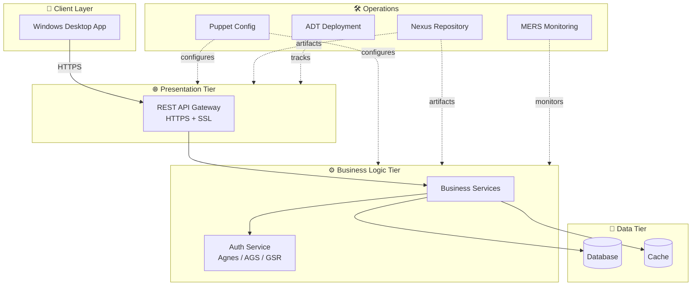
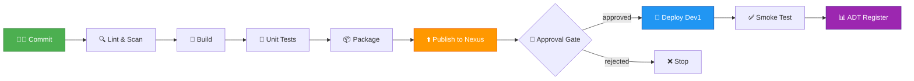

<div align="center">

# 🏦 CTB UBS

### Cut-To-Build Server Migration — Swiss Bank Project

[](./azure-pipelines.yml)
[](./.gitlab-ci.yml)
[](#artifact-publishing)
[](#deployment)
[](./docs/CTB-Checklist.md)
[](#confidentiality)

</div>

---

## 📋 Table of Contents

- [Overview](#-overview)
- [Architecture](#-architecture)
- [Tech Stack](#-tech-stack)
- [Repository Structure](#-repository-structure)
- [CI/CD Pipeline](#-cicd-pipeline)
- [Environments](#-environments)
- [Getting Started](#-getting-started)
- [CTB Work Items](#-ctb-work-items)
- [Documentation](#-documentation)
- [Confidentiality](#-confidentiality)

---

## 🎯 Overview

**CTB UBS** is the migration project that re-platforms a legacy Windows application onto the modern enterprise stack — Azure DevOps for CI/CD, Nexus for artifact management, Puppet for configuration management, and a hardened three-tier (DD2) architecture.

The migration follows a strict **Cut-To-Build (CTB)** lifecycle: every change flows through code review, automated build, security scanning, artifact publication, and gated deployment to the Dev1 environment before promotion further.

### 🎁 Project Goals

| Goal | Outcome |
|---|---|
| 🏗️ Re-architect monolith → 3-tier | Presentation / Business / Data layers cleanly separated (DD2) |
| 🔐 Strengthen Auth | Replace legacy auth with Agnes / AGS / GSR |
| 🚀 Automate delivery | Zero-touch build → publish → deploy via Azure / GitLab pipelines |
| 📦 Centralise artifacts | All builds published to enterprise Nexus repository |
| 🔒 Secure APIs | All API endpoints behind enterprise DNS + SSL certificates |
| 📊 Add observability | MERS monitoring + ADT deployment tracking |

---

## 🏛️ Architecture

### Three-Tier (DD2) Target Architecture



---

## 🛠️ Tech Stack

<table>
<tr>
<th>Layer</th>
<th>Technology</th>
<th>Purpose</th>
</tr>
<tr>
<td>💻 Application</td>
<td><code>.NET</code> Windows Application</td>
<td>Client desktop runtime</td>
</tr>
<tr>
<td>🏛️ Architecture</td>
<td>Three-tier (DD2)</td>
<td>Presentation / Business / Data separation</td>
</tr>
<tr>
<td>🔄 CI/CD</td>
<td>Azure Pipelines · GitLab CI</td>
<td>Automated build & deploy</td>
</tr>
<tr>
<td>📦 Artifacts</td>
<td>Nexus Repository</td>
<td>Versioned binary storage</td>
</tr>
<tr>
<td>⚙️ Config Mgmt</td>
<td>Puppet</td>
<td>Server configuration as code</td>
</tr>
<tr>
<td>🔐 Identity</td>
<td>Agnes · AGS · GSR</td>
<td>Authentication & authorization</td>
</tr>
<tr>
<td>📊 Monitoring</td>
<td>MERS</td>
<td>Application telemetry</td>
</tr>
<tr>
<td>🚀 Deployment</td>
<td>ADT (App Deployment Tool)</td>
<td>Release tracking</td>
</tr>
<tr>
<td>🌐 Networking</td>
<td>Enterprise DNS + SSL CA</td>
<td>Secure API exposure</td>
</tr>
</table>

---

## 📂 Repository Structure

```
CTB-UBS/
├── 📄 README.md                    ← You are here
├── 📄 CHANGELOG.md                 ← Release history
├── 📄 azure-pipelines.yml          ← Azure DevOps pipeline definition
├── 📄 .gitlab-ci.yml               ← GitLab CI pipeline definition
├── 📄 .gitignore
└── 📁 docs/
    ├── 📄 CTB-Checklist.md         ← 16 CTB work items tracker
    ├── 📄 Architecture.md          ← DD2 three-tier design details
    └── 📄 Pipeline-Guide.md        ← CI/CD setup & troubleshooting
```

---

## 🔄 CI/CD Pipeline

The pipeline mirrors enterprise standards used at major Swiss banks — every commit triggers a fully audited build → scan → publish → deploy chain.

### Pipeline Flow



### Pipeline Stages

| Stage | Tool | Outcome |
|---|---|---|
| **1. Source** | Git (Azure Repos / GitLab) | Trigger on push to `main` / `develop` |
| **2. Validate** | Lint + SAST | Code quality + security scan |
| **3. Build** | MSBuild / dotnet | Compiled binaries |
| **4. Test** | xUnit / NUnit | Unit + integration tests |
| **5. Package** | NuGet / MSI | Versioned artifact |
| **6. Publish** | Nexus REST API | Artifact stored in Nexus feed |
| **7. Deploy** | Puppet + ADT | Provision Dev1 + register release |
| **8. Verify** | Smoke tests + MERS | Health check + monitoring |

📖 See [`azure-pipelines.yml`](./azure-pipelines.yml) and [`.gitlab-ci.yml`](./.gitlab-ci.yml) for full configuration.

---

## 🌍 Environments

| Environment | Purpose | Server | Status |
|---|---|---|---|
| 🟡 **Dev1** | Active development & integration | `dev1.ctb.internal` | 🟢 Active |
| ⚪ **SIT** | System integration testing | `sit.ctb.internal` | ⏳ Planned |
| ⚪ **UAT** | User acceptance testing | `uat.ctb.internal` | ⏳ Planned |
| ⚪ **PROD** | Production | `prod.ctb.internal` | 🔒 Restricted |

---

## 🚀 Getting Started

### Prerequisites

```bash
# Required tools
✓ Visual Studio 2022 (or VS Code + .NET SDK)
✓ Git 2.40+
✓ Access to CTB repository (item #1)
✓ Agnes role profile (item #4)
✓ AGS / GSR approval (item #6)
✓ Dev server access (item #8)
```

### Local Build

```bash
# 1. Clone the repository
git clone <repo-url>
cd CTB-UBS

# 2. Restore dependencies (from Nexus feed)
dotnet restore --source https://nexus.internal/repository/nuget-hosted/

# 3. Build
dotnet build --configuration Release

# 4. Run unit tests
dotnet test --no-build --verbosity normal

# 5. Package
dotnet publish -c Release -o ./artifacts
```

### First-Time Pipeline Setup

```bash
# Azure DevOps
az pipelines create --name CTB-UBS-Build --yml-path azure-pipelines.yml

# GitLab
# Pipeline auto-registers from .gitlab-ci.yml on first push to main
```

---

## ✅ CTB Work Items

Progress: **0 / 16** complete · See [full checklist →](./docs/CTB-Checklist.md)

```
Phase 1 — Onboarding         ▱▱▱▱▱  0/4   ⬜⬜⬜⬜
Phase 2 — Build & Auth       ▱▱▱▱▱  0/4   ⬜⬜⬜⬜
Phase 3 — Pipeline           ▱▱▱▱▱  0/4   ⬜⬜⬜⬜
Phase 4 — Deploy & Integrate ▱▱▱▱▱  0/4   ⬜⬜⬜⬜
```

| Phase | Items | Description |
|---|---|---|
| 1️⃣ Onboarding | #1, #2, #4, #8 | Repo + Dev server access, DD2 design, Agnes profiles |
| 2️⃣ Build & Auth | #3, #5, #6 | Local build, auth changes, AGS/GSR |
| 3️⃣ Pipeline | #7, #9, #10, #11 | Pipeline create, Puppet, Nexus, DNS/SSL |
| 4️⃣ Deploy & Integrate | #12, #13, #14, #15, #16 | Dev1 deploy, Nexus auto-resolve, ADT, MERS |

---

## 📚 Documentation

| Document | Description |
|---|---|
| 📋 [CTB Checklist](./docs/CTB-Checklist.md) | All 16 CTB work items, status, owners |
| 🏛️ [Architecture](./docs/Architecture.md) | DD2 three-tier design + diagrams |
| 🔄 [Pipeline Guide](./docs/Pipeline-Guide.md) | CI/CD setup, troubleshooting, secrets |
| 📜 [Changelog](./CHANGELOG.md) | Release history |

---

## 🔒 Confidentiality

> ⚠️ **INTERNAL USE ONLY**
>
> This repository documents a CTB (Swiss bank) server migration. All content is **confidential** and subject to client information-handling policies.
>
> - Do **not** share externally
> - Do **not** include real credentials, server names, or PII in commits
> - Use **private** visibility on any hosted git platform
> - Rotate any secret accidentally committed (`git filter-repo` or BFG)

---

## 👤 Contact

| Role | Owner |
|---|---|
| 👩‍💻 Technical Lead | **Sagarika** |
| 🏗️ Architect | TBD |
| 🚀 Release Manager | TBD |

---

<div align="center">

**Built with discipline. Deployed with confidence.** 🏦

</div>
