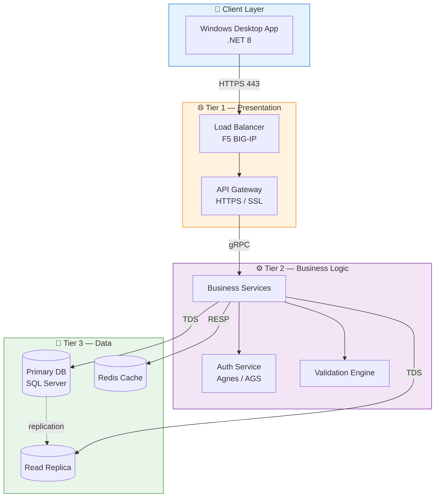
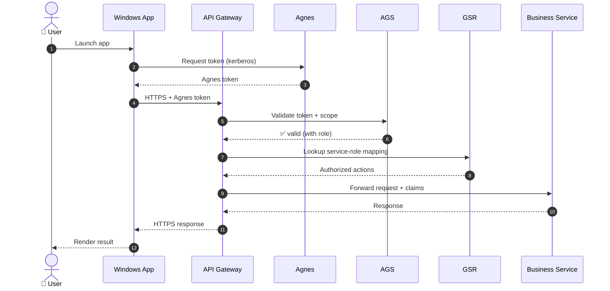
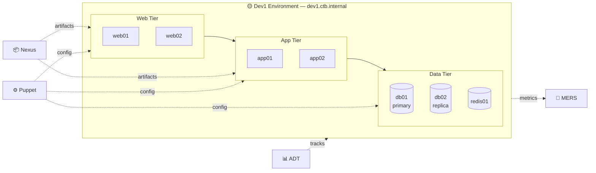
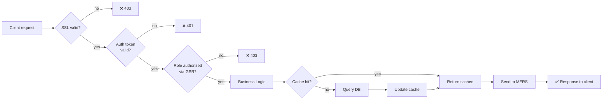

# 🏛️ Architecture — CTB UBS

**Document version:** 1.0
**Last updated:** 2026-04-25
**Owner:** Sagarika

---

## 1. Overview

The CTB application is being migrated from a legacy 2-tier monolith into a hardened **three-tier (DD2)** architecture. The redesign separates concerns cleanly across **Presentation**, **Business Logic**, and **Data** layers, with auth centralised through the bank's enterprise identity stack (Agnes / AGS / GSR).

---

## 2. Three-Tier (DD2) Design



### Tier Responsibilities

| Tier | Responsibility | Tech | Hosted On |
|---|---|---|---|
| **Client** | UI, local validation | .NET 8 WinForms / WPF | End-user workstation |
| **Presentation** | API gateway, SSL termination, rate limiting | REST + gRPC | Dev1 web servers |
| **Business Logic** | Domain logic, auth orchestration, validation | .NET services | Dev1 app servers |
| **Data** | Persistence, caching, replication | SQL Server + Redis | Dev1 DB servers |

---

## 3. Authentication & Authorization Flow



### Auth Components

| Component | Role |
|---|---|
| **Agnes** | Identity provider — issues authentication tokens |
| **AGS** | Access Group Service — validates tokens, maps to access groups |
| **GSR** | Group Service Registry — maps groups to allowed service operations |

---

## 4. Deployment Topology — Dev1



---

## 5. Data Flow — Typical Transaction



---

## 6. Network & Security Boundaries

| Boundary | Control | Item Ref |
|---|---|---|
| Client ↔ Presentation | TLS 1.2+, enterprise SSL cert (fingerprint registered) | #12 |
| Presentation ↔ Business | mTLS, service mesh | #12 |
| Business ↔ Data | Encrypted DB connection (TDS-over-TLS) | — |
| All → MERS | Outbound HTTPS, app-team token | #18 |
| Pipeline → Nexus | Token auth, RBAC | #11 |
| Pipeline → Dev1 | Puppet agent, signed manifests | #9, #13 |

---

## 7. Configuration Management — Puppet

Puppet manifests live in a sibling repo (`ctb-ubs-puppet`) and are applied automatically by the pipeline (item #9).

> ⚠️ **Module content rule (item #10):** the Puppet module carries **server configuration only**. Do not upload application services, `.cs` source files, or other `.sln` solution paths into the module — application binaries are always pulled from Nexus.


```puppet
# Example excerpt — node 'app01.dev1.ctb.internal'
class { 'ctb_ubs::app':
  version       => $facts['ctb_app_version'],
  nexus_url     => 'https://nexus.internal/repository/ctb-ubs-releases/',
  agnes_realm   => 'CTB.INTERNAL',
  ssl_cert_path => '/etc/ssl/ctb/api.crt',
  mers_endpoint => 'https://mers.internal/events',
}
```

---

## 8. Future State (Post-Migration)

- Move from Dev1 → SIT → UAT → PROD using the same pipeline
- Add active-active replication across data centres
- Enable canary deployments via ADT
- Integrate full distributed tracing into MERS

---

## 📚 Related Documents

- [README](../README.md)
- [CTB Checklist](./CTB-Checklist.md)
- [Pipeline Guide](./Pipeline-Guide.md)
