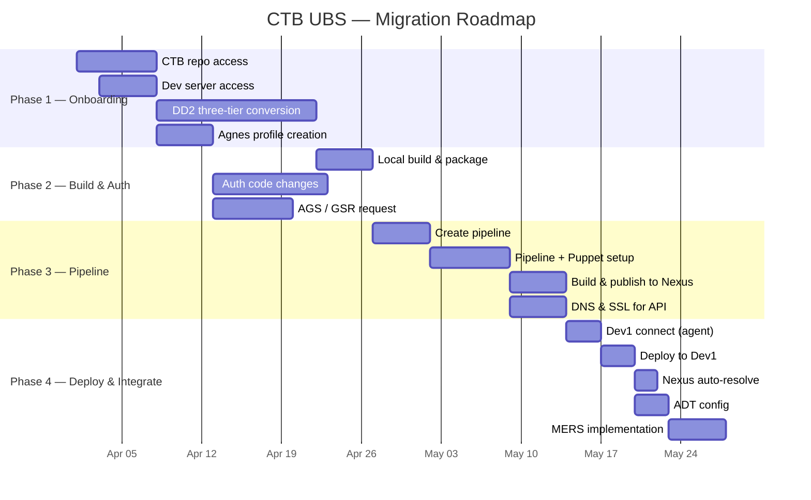

# 📋 CTB Work Item Checklist

**Project:** CTB (Swiss Bank Project) — Server Migration
**Owner:** Sagarika
**Last Updated:** 2026-04-25
**Total items:** 16

---

## 📊 Progress Dashboard

```
Overall Progress  ▱▱▱▱▱▱▱▱▱▱▱▱▱▱▱▱  0/16  (0%)

┌─────────────────────────────────────────────────────────┐
│ Phase 1 — Onboarding         ▱▱▱▱  0/4   ⬜⬜⬜⬜       │
│ Phase 2 — Build & Auth       ▱▱▱   0/3   ⬜⬜⬜          │
│ Phase 3 — Pipeline           ▱▱▱▱  0/4   ⬜⬜⬜⬜       │
│ Phase 4 — Deploy & Integrate ▱▱▱▱▱ 0/5   ⬜⬜⬜⬜⬜    │
└─────────────────────────────────────────────────────────┘
```

| Phase | Pending | In Progress | Done | Blocked |
|---|---|---|---|---|
| 1️⃣ Onboarding | 4 | 0 | 0 | 0 |
| 2️⃣ Build & Auth | 3 | 0 | 0 | 0 |
| 3️⃣ Pipeline | 4 | 0 | 0 | 0 |
| 4️⃣ Deploy & Integrate | 5 | 0 | 0 | 0 |
| **Total** | **16** | **0** | **0** | **0** |

---

## 🗺️ Roadmap



---

## 1️⃣ Phase 1 — Onboarding

> **Goal:** secure access, validate identity, lock in three-tier architecture design.

### #1 — CTB repository access

| Field | Value |
|---|---|
| **Status** | ⬜ Pending |
| **Owner** | Sagarika |
| **Phase** | Onboarding |
| **Depends on** | — |

**Description:** Request and receive access to the CTB GitLab / Azure DevOps repository.

**Acceptance criteria:**
- [ ] Access request raised with Identity team
- [ ] `git clone` succeeds from local machine
- [ ] Read + write permissions confirmed on `develop` branch

---

### #2 — DD2 (Three-tier conversion)

| Field | Value |
|---|---|
| **Status** | ⬜ Pending |
| **Owner** | Sagarika |
| **Phase** | Onboarding |
| **Depends on** | #1 |

**Description:** Execute the three-tier conversion as described in DD2 design document — split monolith into Presentation, Business Logic, and Data tiers.

**Acceptance criteria:**
- [ ] DD2 design reviewed and signed off
- [ ] Presentation tier scaffolded
- [ ] Business logic tier scaffolded
- [ ] Data tier scaffolded
- [ ] Inter-tier contracts (DTOs / interfaces) defined

📖 See [Architecture.md](./Architecture.md#2-three-tier-dd2-design).

---

### #4 — Agnes roles profile creation

| Field | Value |
|---|---|
| **Status** | ⬜ Pending |
| **Owner** | Sagarika |
| **Phase** | Onboarding |
| **Depends on** | #1 |

**Description:** Create Agnes identity profiles for service accounts and developers.

**Acceptance criteria:**
- [ ] Service account profile created
- [ ] Developer profiles created
- [ ] Roles mapped (read / write / deploy)
- [ ] Tested via `kinit` against `CTB.INTERNAL` realm

---

### #8 — Dev server access

| Field | Value |
|---|---|
| **Status** | ⬜ Pending |
| **Owner** | Sagarika |
| **Phase** | Onboarding |
| **Depends on** | #4 |

**Description:** Provision developer access to the Dev environment (jump host + Dev server).

**Acceptance criteria:**
- [ ] VPN configured
- [ ] Jump host SSH access verified
- [ ] Dev server reachable via internal DNS
- [ ] Sudo / admin permissions where required

---

## 2️⃣ Phase 2 — Build & Auth

> **Goal:** build the application locally, integrate enterprise auth.

### #3 — Locally build application & package configuration

| Field | Value |
|---|---|
| **Status** | ⬜ Pending |
| **Owner** | Sagarika |
| **Phase** | Build & Auth |
| **Depends on** | #1, #2 |

**Description:** Build application locally and configure package management (NuGet) to point to Nexus.

**Acceptance criteria:**
- [ ] `dotnet restore` resolves all packages from Nexus
- [ ] `dotnet build --configuration Release` succeeds
- [ ] All unit tests pass locally
- [ ] `nuget.config` checked in to repo

---

### #5 — Authentication & authorization code changes (Windows app)

| Field | Value |
|---|---|
| **Status** | ⬜ Pending |
| **Owner** | Sagarika |
| **Phase** | Build & Auth |
| **Depends on** | #3, #4 |

**Description:** Replace legacy auth code with Agnes-based token flow.

**Acceptance criteria:**
- [ ] Agnes SDK integrated
- [ ] Token acquisition tested
- [ ] AGS validation endpoint called
- [ ] GSR role lookup integrated
- [ ] Login + logout flows verified end-to-end

📖 See [Architecture.md — Auth Flow](./Architecture.md#3-authentication--authorization-flow).

---

### #6 — AGS / GSR request (CTB)

| Field | Value |
|---|---|
| **Status** | ⬜ Pending |
| **Owner** | Sagarika |
| **Phase** | Build & Auth |
| **Depends on** | #4 |

**Description:** Submit AGS access group and GSR service request for the CTB application.

**Acceptance criteria:**
- [ ] AGS access group created (`ctb-ubs-users`)
- [ ] GSR service entry registered (`ctb-ubs-api`)
- [ ] Allowed actions per role documented
- [ ] Test calls return expected scopes

---

## 3️⃣ Phase 3 — Pipeline

> **Goal:** stand up CI/CD, publish to Nexus, secure APIs.

### #7 — Creating pipeline

| Field | Value |
|---|---|
| **Status** | ⬜ Pending |
| **Owner** | Sagarika |
| **Phase** | Pipeline |
| **Depends on** | #3 |

**Description:** Create initial Azure / GitLab pipeline definition.

**Acceptance criteria:**
- [ ] `azure-pipelines.yml` checked in
- [ ] `.gitlab-ci.yml` checked in
- [ ] Build agent pool registered
- [ ] First green build on `develop`

📖 See [Pipeline-Guide.md](./Pipeline-Guide.md).

---

### #9 — Pipeline setup (Application + Puppet for server config)

| Field | Value |
|---|---|
| **Status** | ⬜ Pending |
| **Owner** | Sagarika |
| **Phase** | Pipeline |
| **Depends on** | #7 |

**Description:** Integrate Puppet manifests into the pipeline so server config is deployed alongside the application.

**Acceptance criteria:**
- [ ] Puppet manifest repo created (`ctb-ubs-puppet`)
- [ ] Pipeline applies manifests to Dev1
- [ ] Drift detection enabled
- [ ] Rollback verified

---

### #10 — Build in pipeline, publish for Nexus

| Field | Value |
|---|---|
| **Status** | ⬜ Pending |
| **Owner** | Sagarika |
| **Phase** | Pipeline |
| **Depends on** | #7 |

**Description:** Configure pipeline to compile, package, and push artifacts to Nexus.

**Acceptance criteria:**
- [ ] Build artifacts produced (MSI + NuGet)
- [ ] Push to `ctb-ubs-snapshots` (develop) succeeds
- [ ] Push to `ctb-ubs-releases` (main) succeeds
- [ ] Versioning scheme documented

---

### #11 — DNS and SSL certification for API

| Field | Value |
|---|---|
| **Status** | ⬜ Pending |
| **Owner** | Sagarika |
| **Phase** | Pipeline |
| **Depends on** | #9 |

**Description:** Register DNS and obtain SSL certificate for the API endpoint.

**Acceptance criteria:**
- [ ] DNS entry `api.dev1.ctb.internal` created
- [ ] SSL certificate issued by enterprise CA
- [ ] Cert installed on Dev1 web tier
- [ ] HTTPS handshake succeeds (TLS 1.2+)

---

## 4️⃣ Phase 4 — Deploy & Integrate

> **Goal:** deploy to Dev1, integrate ADT and MERS.

### #12 — Dev1 server connect (Artifact registration, Agent user installation)

| Field | Value |
|---|---|
| **Status** | ⬜ Pending |
| **Owner** | Sagarika |
| **Phase** | Deploy & Integrate |
| **Depends on** | #8, #10 |

**Description:** Connect Dev1 to the pipeline — register artifact source, install build agent.

**Acceptance criteria:**
- [ ] Pipeline agent installed on Dev1
- [ ] Agent user has required permissions
- [ ] Artifact source registered (Nexus URL configured)
- [ ] Test job runs successfully on Dev1 agent

---

### #13 — Deploy in Dev1

| Field | Value |
|---|---|
| **Status** | ⬜ Pending |
| **Owner** | Sagarika |
| **Phase** | Deploy & Integrate |
| **Depends on** | #11, #12 |

**Description:** Execute first end-to-end deployment to Dev1.

**Acceptance criteria:**
- [ ] Application installed via MSI
- [ ] Service starts cleanly
- [ ] Smoke test (health endpoint) passes
- [ ] Logs visible in MERS

---

### #14 — Automatically showing Nexus repository

| Field | Value |
|---|---|
| **Status** | ⬜ Pending |
| **Owner** | Sagarika |
| **Phase** | Deploy & Integrate |
| **Depends on** | #13 |

**Description:** Verify Dev1 auto-resolves and pulls artifacts from Nexus on each deployment.

**Acceptance criteria:**
- [ ] Nexus repository visible in deployment dashboard
- [ ] Latest version auto-resolved by pipeline
- [ ] Artifact integrity verified (checksum match)

---

### #15 — ADT config

| Field | Value |
|---|---|
| **Status** | ⬜ Pending |
| **Owner** | Sagarika |
| **Phase** | Deploy & Integrate |
| **Depends on** | #13 |

**Description:** Configure ADT (Application Deployment Tool) for the migrated application.

**Acceptance criteria:**
- [ ] ADT application record created
- [ ] Environment mapping defined (Dev1, SIT, UAT, PROD)
- [ ] Deployment hooks register from pipeline
- [ ] ADT dashboard reflects last deployment

---

### #16 — MERS implementation

| Field | Value |
|---|---|
| **Status** | ⬜ Pending |
| **Owner** | Sagarika |
| **Phase** | Deploy & Integrate |
| **Depends on** | #13 |

**Description:** Integrate MERS (Monitoring / Event / Reporting System) for the application.

**Acceptance criteria:**
- [ ] Application emits events to MERS
- [ ] Pipeline emits build/deploy events to MERS
- [ ] Dashboards configured for app + pipeline metrics
- [ ] Alert rules tuned (5xx errors, deploy failures)

---

## 🔑 Status Legend

| Symbol | Meaning |
|---|---|
| ⬜ | Pending — not yet started |
| 🔄 | In Progress — actively being worked |
| ✅ | Done — completed and verified |
| ❌ | Blocked — awaiting dependency or approval |

---

## 📝 How to Update

1. Open this file
2. Replace ⬜ with 🔄 or ✅ in the Status field
3. Tick the relevant acceptance criteria checkboxes
4. Update the **Progress Dashboard** counts at the top
5. Commit with message: `chore(ctb): mark item #N as <status>`

---

## 📚 Related Documents

- [README](../README.md)
- [Architecture](./Architecture.md)
- [Pipeline Guide](./Pipeline-Guide.md)
