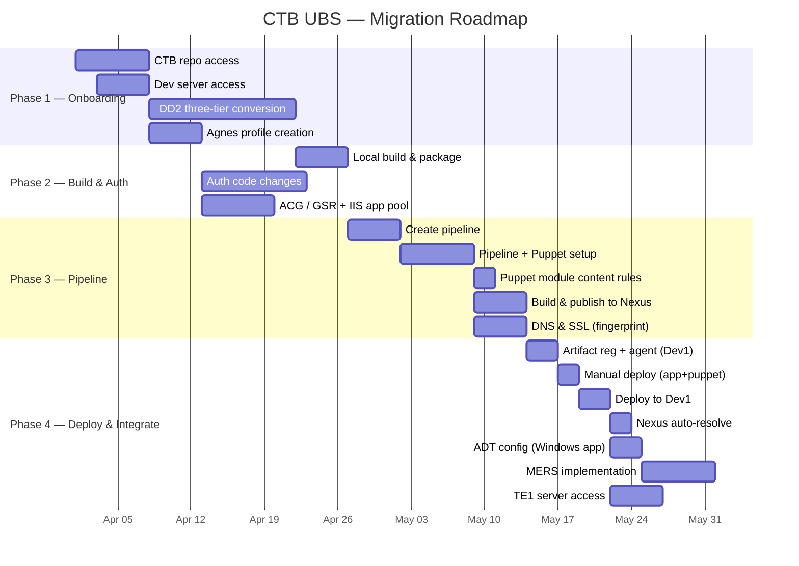

# 📋 CTB Work Item Checklist

**Project:** CTB (Swiss Bank Project) — Server Migration
**Owner:** Sagarika
**Last Updated:** 2026-07-04
**Total items:** 19

---

## 📊 Progress Dashboard

```
Overall Progress  ▱▱▱▱▱▱▱▱▱▱▱▱▱▱▱▱▱▱▱  0/19  (0%)

┌─────────────────────────────────────────────────────────┐
│ Phase 1 — Onboarding         ▱▱▱▱    0/4   ⬜⬜⬜⬜      │
│ Phase 2 — Build & Auth       ▱▱▱     0/3   ⬜⬜⬜        │
│ Phase 3 — Pipeline           ▱▱▱▱▱   0/5   ⬜⬜⬜⬜⬜    │
│ Phase 4 — Deploy & Integrate ▱▱▱▱▱▱▱ 0/7   ⬜⬜⬜⬜⬜⬜⬜│
└─────────────────────────────────────────────────────────┘
```

| Phase | Pending | In Progress | Done | Blocked |
|---|---|---|---|---|
| 1️⃣ Onboarding | 4 | 0 | 0 | 0 |
| 2️⃣ Build & Auth | 3 | 0 | 0 | 0 |
| 3️⃣ Pipeline | 5 | 0 | 0 | 0 |
| 4️⃣ Deploy & Integrate | 7 | 0 | 0 | 0 |
| **Total** | **19** | **0** | **0** | **0** |

---

## 🗺️ Roadmap



---

## 1️⃣ Phase 1 — Onboarding

> **Goal:** secure access, validate identity, lock in three-tier architecture design.

### #1 — CTB repository access

| Field | Value |
|---|---|
| **Status** | ⬜ Pending |
| **Owner** | Sagarika |
| **Phase** | Onboarding |
| **Depends on** | — |

**Description:** Request and receive access to the CTB GitLab / Azure DevOps repository.

**Acceptance criteria:**
- [ ] Access request raised with Identity team
- [ ] `git clone` succeeds from local machine
- [ ] Read + write permissions confirmed on `develop` branch

---

### #2 — DD2 (Three-tier conversion)

| Field | Value |
|---|---|
| **Status** | ⬜ Pending |
| **Owner** | Sagarika |
| **Phase** | Onboarding |
| **Depends on** | #1 |

**Description:** Execute the three-tier conversion as described in DD2 design document — split monolith into Presentation, Business Logic, and Data tiers.

**Acceptance criteria:**
- [ ] DD2 design reviewed and signed off
- [ ] Presentation tier scaffolded
- [ ] Business logic tier scaffolded
- [ ] Data tier scaffolded
- [ ] Inter-tier contracts (DTOs / interfaces) defined

📖 See [Architecture.md](./Architecture.md#2-three-tier-dd2-design).

---

### #4 — Agnes roles profile creation

| Field | Value |
|---|---|
| **Status** | ⬜ Pending |
| **Owner** | Sagarika |
| **Phase** | Onboarding |
| **Depends on** | #1 |

**Description:** Create Agnes identity profiles for service accounts and developers.

**Acceptance criteria:**
- [ ] Service account profile created
- [ ] Developer profiles created
- [ ] Roles mapped (read / write / deploy)
- [ ] Tested via `kinit` against `CTB.INTERNAL` realm

---

### #8 — Dev server access

| Field | Value |
|---|---|
| **Status** | ⬜ Pending |
| **Owner** | Sagarika |
| **Phase** | Onboarding |
| **Depends on** | #4 |

**Description:** Provision developer access to the Dev environment (jump host + Dev server).

**Acceptance criteria:**
- [ ] VPN configured
- [ ] Jump host SSH access verified
- [ ] Dev server reachable via internal DNS
- [ ] Sudo / admin permissions where required

---

## 2️⃣ Phase 2 — Build & Auth

> **Goal:** build the application locally, integrate enterprise auth.

### #3 — Locally build application & package configuration

| Field | Value |
|---|---|
| **Status** | ⬜ Pending |
| **Owner** | Sagarika |
| **Phase** | Build & Auth |
| **Depends on** | #1, #2 |

**Description:** Build application locally and configure package management (NuGet) to point to Nexus.

**Acceptance criteria:**
- [ ] `dotnet restore` resolves all packages from Nexus
- [ ] `dotnet build --configuration Release` succeeds
- [ ] All unit tests pass locally
- [ ] `nuget.config` checked in to repo

---

### #5 — Authentication & authorization code changes (Windows app)

| Field | Value |
|---|---|
| **Status** | ⬜ Pending |
| **Owner** | Sagarika |
| **Phase** | Build & Auth |
| **Depends on** | #3, #4 |

**Description:** Replace legacy auth code with Agnes-based token flow.

**Acceptance criteria:**
- [ ] Agnes SDK integrated
- [ ] Token acquisition tested
- [ ] ACG validation endpoint called
- [ ] GSR role lookup integrated
- [ ] Login + logout flows verified end-to-end

📖 See [Architecture.md — Auth Flow](./Architecture.md#3-authentication--authorization-flow).

---

### #6 — ACG / GSR request (CTB) — IIS application pool permission

| Field | Value |
|---|---|
| **Status** | ⬜ Pending |
| **Owner** | Sagarika |
| **Phase** | Build & Auth |
| **Depends on** | #4 |

**Description:** Submit ACG access group and GSR service request for the CTB application, including IIS-related application pool permissions for the hosted API.

**Acceptance criteria:**
- [ ] ACG access group created (`ctb-ubs-users`)
- [ ] GSR service entry registered (`ctb-ubs-api`)
- [ ] IIS application pool identity granted required permissions
- [ ] App pool runs under approved service account
- [ ] Allowed actions per role documented
- [ ] Test calls return expected scopes

---

## 3️⃣ Phase 3 — Pipeline

> **Goal:** stand up CI/CD, publish to Nexus, secure APIs.

### #7 — Creating pipeline (build + Nexus upload: snapshot & release)

| Field | Value |
|---|---|
| **Status** | ⬜ Pending |
| **Owner** | Sagarika |
| **Phase** | Pipeline |
| **Depends on** | #3 |

**Description:** Create initial Azure / GitLab pipeline definition. Pipeline must build the application and upload artifacts to Nexus, with both **snapshot** and **release** uploads passing.

**Acceptance criteria:**
- [ ] `azure-pipelines.yml` checked in
- [ ] `.gitlab-ci.yml` checked in
- [ ] Build agent pool registered
- [ ] First green build on `develop`
- [ ] Nexus **snapshot** upload passed
- [ ] Nexus **release** upload passed

📖 See [Pipeline-Guide.md](./Pipeline-Guide.md).

---

### #9 — Pipeline setup (Application setup + Puppet module for server config)

| Field | Value |
|---|---|
| **Status** | ⬜ Pending |
| **Owner** | Sagarika |
| **Phase** | Pipeline |
| **Depends on** | #7 |

**Description:** Set up the application in the pipeline and create the Puppet module used for server configuration, so server config is deployed alongside the application.

**Acceptance criteria:**
- [ ] Application set up in pipeline
- [ ] Puppet module repo created (`ctb-ubs-puppet`)
- [ ] Pipeline applies Puppet module to Dev1
- [ ] Drift detection enabled
- [ ] Rollback verified

---

### #10 — Puppet module content rules (exclude services, .cs files, .sln paths)

| Field | Value |
|---|---|
| **Status** | ⬜ Pending |
| **Owner** | Sagarika |
| **Phase** | Pipeline |
| **Depends on** | #9 |

**Description:** During Puppet module creation, do **not** upload application services, `.cs` source files, or other `.sln` solution paths into the module. The Puppet module must contain server configuration only — application binaries come from Nexus.

**Acceptance criteria:**
- [ ] Puppet module contains config/manifests only
- [ ] No `Services` folders included in module
- [ ] No `.cs` source files included in module
- [ ] No `.sln` / solution-relative paths included in module
- [ ] Module review confirms clean separation (config vs. app artifacts)

---

### #11 — Build in pipeline, publish for Nexus

| Field | Value |
|---|---|
| **Status** | ⬜ Pending |
| **Owner** | Sagarika |
| **Phase** | Pipeline |
| **Depends on** | #7 |

**Description:** Configure pipeline to compile, package, and push artifacts to Nexus.

**Acceptance criteria:**
- [ ] Build artifacts produced (MSI + NuGet)
- [ ] Push to `ctb-ubs-snapshots` (develop) succeeds
- [ ] Push to `ctb-ubs-releases` (main) succeeds
- [ ] Versioning scheme documented

---

### #12 — DNS and SSL certification for API (fingerprint required)

| Field | Value |
|---|---|
| **Status** | ⬜ Pending |
| **Owner** | Sagarika |
| **Phase** | Pipeline |
| **Depends on** | #9 |

**Description:** Register DNS and obtain SSL certificate for the API endpoint. The certificate **fingerprint (thumbprint)** is required for binding/config registration.

**Acceptance criteria:**
- [ ] DNS entry `api.dev1.ctb.internal` created
- [ ] SSL certificate issued by enterprise CA
- [ ] Certificate fingerprint (thumbprint) captured and registered in config
- [ ] Cert installed on Dev1 web tier and bound in IIS
- [ ] HTTPS handshake succeeds (TLS 1.2+)

---

## 4️⃣ Phase 4 — Deploy & Integrate

> **Goal:** deploy to Dev1, integrate ADT and MERS, extend access to TE1.

### #13 — Artifact registration & agent installation (Dev1 server deployment)

| Field | Value |
|---|---|
| **Status** | ⬜ Pending |
| **Owner** | Sagarika |
| **Phase** | Deploy & Integrate |
| **Depends on** | #8, #11 |

**Description:** Connect Dev1 to the pipeline — register the artifact, install the deployment agent on the Dev1 server.

**Acceptance criteria:**
- [ ] Artifact registered (Nexus URL / source configured)
- [ ] Pipeline agent installed on Dev1
- [ ] Agent user has required permissions
- [ ] Test job runs successfully on Dev1 agent

---

### #14 — Manual deploy (application files + Puppet module)

| Field | Value |
|---|---|
| **Status** | ⬜ Pending |
| **Owner** | Sagarika |
| **Phase** | Deploy & Integrate |
| **Depends on** | #10, #13 |

**Description:** Deploy the application files and the Puppet module **manually** to validate the deployment path before automating it.

**Acceptance criteria:**
- [ ] Application files copied/deployed manually to Dev1
- [ ] Puppet module applied manually on Dev1
- [ ] Server configuration verified after manual Puppet run
- [ ] Manual steps documented for the runbook

---

### #15 — Deploy in Dev1 (application file deploy)

| Field | Value |
|---|---|
| **Status** | ⬜ Pending |
| **Owner** | Sagarika |
| **Phase** | Deploy & Integrate |
| **Depends on** | #12, #14 |

**Description:** Execute first end-to-end deployment to Dev1 through the pipeline.

**Acceptance criteria:**
- [ ] Application files deployed via pipeline
- [ ] Service starts cleanly
- [ ] Smoke test (health endpoint) passes
- [ ] Logs visible in MERS / Grafana

---

### #16 — Automatically showing Nexus repository

| Field | Value |
|---|---|
| **Status** | ⬜ Pending |
| **Owner** | Sagarika |
| **Phase** | Deploy & Integrate |
| **Depends on** | #15 |

**Description:** Verify Dev1 auto-resolves and pulls artifacts from Nexus on each deployment — the Nexus repository shows up automatically after pipeline publish.

**Acceptance criteria:**
- [ ] Nexus repository visible in deployment dashboard
- [ ] Latest version auto-resolved by pipeline
- [ ] Artifact integrity verified (checksum match)

---

### #17 — ADT config for Windows app

| Field | Value |
|---|---|
| **Status** | ⬜ Pending |
| **Owner** | Sagarika |
| **Phase** | Deploy & Integrate |
| **Depends on** | #15 |

**Description:** Configure ADT (Application Deployment Tool) for the migrated **Windows application**.

**Acceptance criteria:**
- [ ] ADT application record created for the Windows app
- [ ] Environment mapping defined (Dev1, TE1, SIT, UAT, PROD)
- [ ] Deployment hooks register from pipeline
- [ ] ADT dashboard reflects last deployment

---

### #18 — MERS implementation

| Field | Value |
|---|---|
| **Status** | ⬜ Pending |
| **Owner** | Sagarika |
| **Phase** | Deploy & Integrate |
| **Depends on** | #15 |

**Description:** Integrate MERS monitoring for the application across four workstreams: OpenTelemetry onboarding, Grafana alerting via Big Panda, CID-5 label validation, and token-based authentication.

#### 18.1 — OpenTelemetry (request via BBS)

- [ ] MERS onboarding request raised through **BBS**
- [ ] OpenTelemetry instrumentation added to the application
- [ ] **MERS EM1 → Grafana** used for logs
- [ ] Grafana dashboards show IIS details, CPU, and disk metrics

#### 18.2 — Alerting (request via Big Panda)

- [ ] Alert request raised through **Big Panda** for Grafana alerts
- [ ] Alert rules configured (5xx errors, deploy failures, CPU/disk thresholds)
- [ ] Alert routing verified end-to-end

#### 18.3 — CID-5 label validation

- [ ] **CID-5** MERS implementation completed for label validation
- [ ] Labels validated against CID-5 requirements
- [ ] Validation results signed off

#### 18.4 — Authentication (token creation, app team side)

- [ ] MERS auth token created on the application team side
- [ ] Token stored securely (vault / pipeline secret, never in code)
- [ ] Authenticated telemetry flow verified

---

### #19 — TE1 server access for deployment

| Field | Value |
|---|---|
| **Status** | ⬜ Pending |
| **Owner** | Sagarika |
| **Phase** | Deploy & Integrate |
| **Depends on** | #15 |

**Description:** Request and provision access to the **TE1** server so deployments can be promoted beyond Dev1.

**Acceptance criteria:**
- [ ] TE1 access request raised
- [ ] TE1 server reachable (login verified)
- [ ] Deployment agent / permissions in place on TE1
- [ ] Test deployment to TE1 succeeds

---

## 🔑 Status Legend

| Symbol | Meaning |
|---|---|
| ⬜ | Pending — not yet started |
| 🔄 | In Progress — actively being worked |
| ✅ | Done — completed and verified |
| ❌ | Blocked — awaiting dependency or approval |

---

## 📝 How to Update

1. Open this file
2. Replace ⬜ with 🔄 or ✅ in the Status field
3. Tick the relevant acceptance criteria checkboxes
4. Update the **Progress Dashboard** counts at the top
5. Commit with message: `chore(ctb): mark item #N as <status>`

---

## 📚 Related Documents

- [README](../README.md)
- [Architecture](./Architecture.md)
- [Pipeline Guide](./Pipeline-Guide.md)
