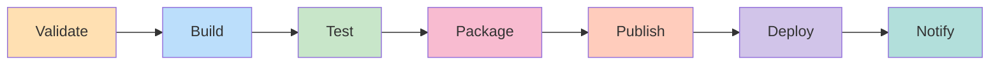
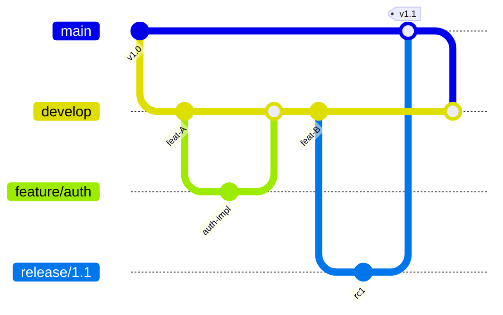
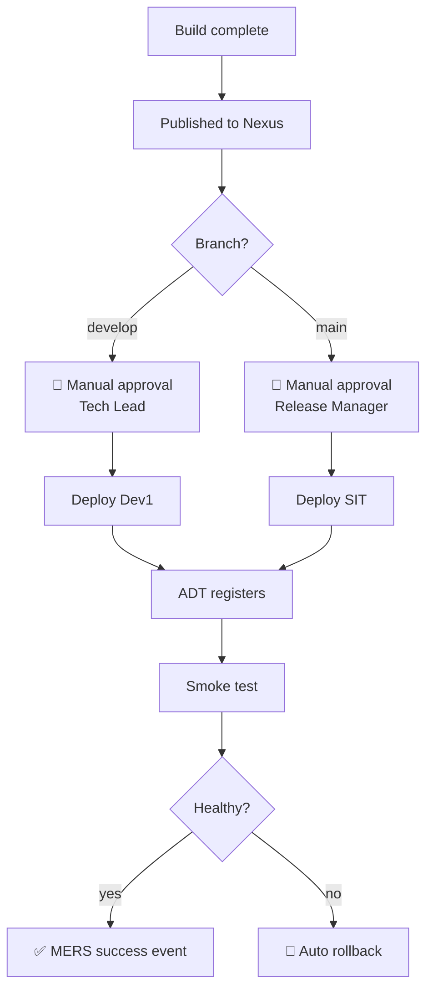

# 🔄 Pipeline Guide — CTB UBS

**Document version:** 1.0
**Last updated:** 2026-04-25
**Owner:** Sagarika

---

## 1. Pipeline Overview

The CTB UBS project runs **dual pipelines** — one for **Azure DevOps** and a parallel one for **GitLab CI**. Both produce identical artifacts published to the same Nexus repository, ensuring environment parity regardless of which CI host is active.

| Platform | Definition File | Trigger |
|---|---|---|
| Azure Pipelines | [`azure-pipelines.yml`](../azure-pipelines.yml) | Push / PR to `main`, `develop`, `release/*` |
| GitLab CI | [`.gitlab-ci.yml`](../.gitlab-ci.yml) | Push / MR to `main`, `develop` |

---

## 2. Pipeline Stages



| # | Stage | Duration | Critical? |
|---|---|---|---|
| 1 | **Validate** — lint, format, SAST | ~2 min | ✅ Yes |
| 2 | **Build** — compile solution | ~5 min | ✅ Yes |
| 3 | **Test** — unit + integration | ~4 min | ✅ Yes |
| 4 | **Package** — MSI + NuGet | ~2 min | ✅ Yes |
| 5 | **Publish** — push to Nexus | ~1 min | ✅ Yes |
| 6 | **Deploy** — Puppet → Dev1 | ~6 min | Manual gate |
| 7 | **Notify** — MERS event | ~10 sec | Best-effort |

**Total typical run:** ~20 minutes

---

## 3. Required Pipeline Secrets

Configure these in Azure DevOps **Library → Variable Groups** (`ctb-ubs-secrets`) and GitLab **Settings → CI/CD → Variables**.

| Variable | Type | Used By | Description |
|---|---|---|---|
| `NEXUS_USER` | string | Build, Publish | Nexus service account username |
| `NEXUS_PASS` | masked | Build, Publish | Nexus service account password |
| `NEXUS_API_KEY` | masked | Publish | Token for `nuget push` to Nexus |
| `SONAR_TOKEN` | masked | Validate | SonarQube auth token |
| `SONAR_HOST_URL` | string | Validate | `https://sonar.internal` |
| `ADT_TOKEN` | masked | Deploy | Bearer token for ADT registration API |
| `AGNES_REALM` | string | Deploy | `CTB.INTERNAL` |
| `SSL_CERT_THUMBPRINT` | string | Deploy | Cert thumbprint for API binding |

> ⚠️ **Never commit secrets.** Rotate immediately if exposed.

---

## 4. Build Agents

### Azure DevOps
- **Pool:** `CTB-Windows-Agents`
- **OS:** Windows Server 2022
- **Capabilities:** `msbuild`, `visualstudio`, `dotnet 8.0`, `puppet-agent`

### GitLab CI
- **Runner tag:** `ctb-runner`, `windows`
- **Image:** `mcr.microsoft.com/dotnet/sdk:8.0`

Agent installation on Dev1 covered in **CTB item #12**.

---

## 5. Branching Strategy



| Branch | Purpose | Auto-deploys to |
|---|---|---|
| `main` | Production-ready code | (manual → SIT) |
| `develop` | Integration branch | **Dev1** (manual gate) |
| `feature/*` | Active development | none (build + test only) |
| `release/*` | Release stabilisation | (manual → UAT) |
| `hotfix/*` | Production patches | (manual → all envs) |

---

## 6. Nexus Repository Layout

```
nexus.internal/
└── repository/
    ├── ctb-ubs-releases/      ← Production-grade builds (main)
    ├── ctb-ubs-snapshots/     ← develop branch builds
    ├── ctb-ubs-pr/            ← Per-MR ephemeral builds (TTL 7d)
    └── nuget-hosted/          ← Mirrored upstream NuGet packages
```

Configure your local `nuget.config`:

```xml
<?xml version="1.0" encoding="utf-8"?>
<configuration>
  <packageSources>
    <clear />
    <add key="nexus" value="https://nexus.internal/repository/nuget-hosted/" />
    <add key="ctb-releases" value="https://nexus.internal/repository/ctb-ubs-releases/" />
  </packageSources>
  <packageSourceCredentials>
    <nexus>
      <add key="Username" value="%NEXUS_USER%" />
      <add key="ClearTextPassword" value="%NEXUS_PASS%" />
    </nexus>
  </packageSourceCredentials>
</configuration>
```

---

## 7. Deployment Gates



---

## 8. Troubleshooting

### Build fails — "package not found"
- Verify `nuget.config` points to Nexus, not nuget.org
- Check `NEXUS_USER` / `NEXUS_PASS` variables are set in pipeline
- Confirm package exists in Nexus: `https://nexus.internal/#browse/`

### Deploy fails — "Puppet agent timeout"
- Check Puppet master is reachable: `ssh dev1.ctb.internal "puppet agent --test"`
- Verify cert is signed: `puppet cert list --all` on master
- Review item **#9** for Puppet pipeline integration

### SSL handshake error on smoke test
- Confirm cert is installed at `/etc/ssl/ctb/api.crt`
- DNS entry `api.dev1.ctb.internal` must resolve (item **#11**)
- Check cert chain: `openssl s_client -connect api.dev1.ctb.internal:443 -showcerts`

### ADT registration returns 401
- `ADT_TOKEN` rotated? Refresh from ADT portal
- Check service account has `deployment.write` scope

### MERS notification missing
- Non-blocking by design — pipeline continues
- Check `mers.internal` reachability from build agent
- Confirm payload schema matches MERS v2 contract

---

## 9. Pipeline Performance Tips

- **Cache `~/.nuget/packages`** between runs (saves ~3 min)
- **Use shallow clones** (`fetchDepth: 1`) for non-SonarQube jobs
- **Parallelise tests** with `--parallel` flag in `dotnet test`
- **Skip docs-only commits** via `paths-ignore` rules

---

## 📚 Related Documents

- [README](../README.md)
- [Architecture](./Architecture.md)
- [CTB Checklist](./CTB-Checklist.md)
